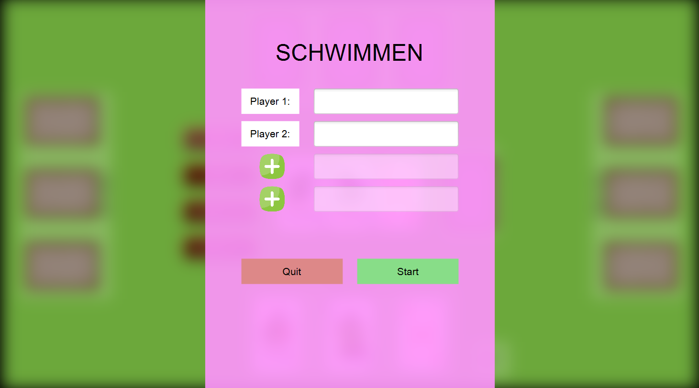
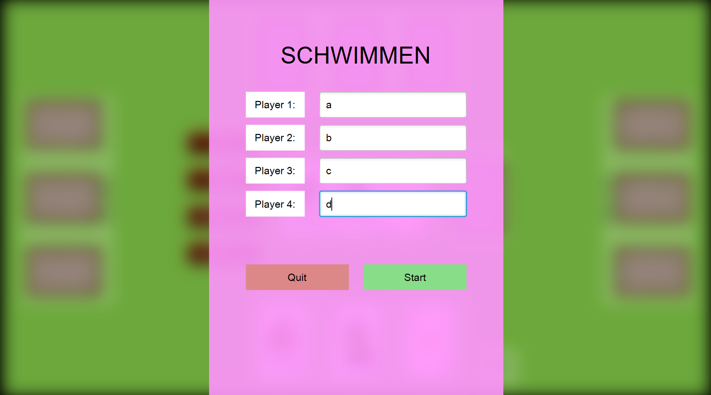
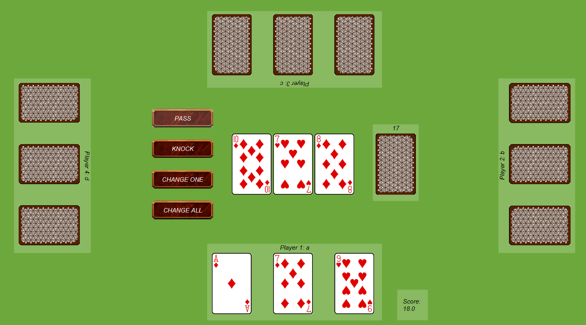
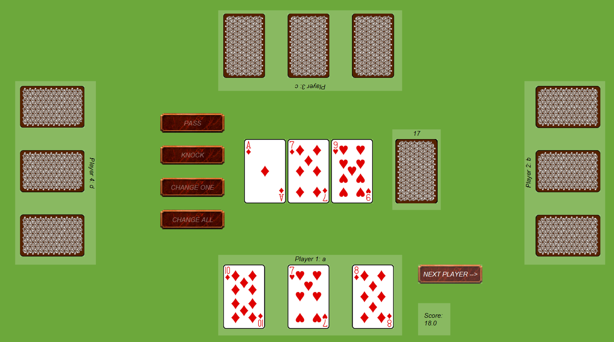
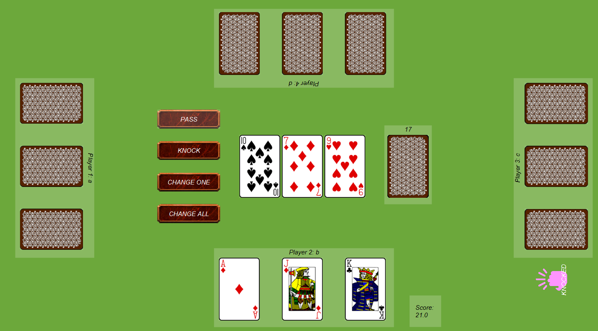
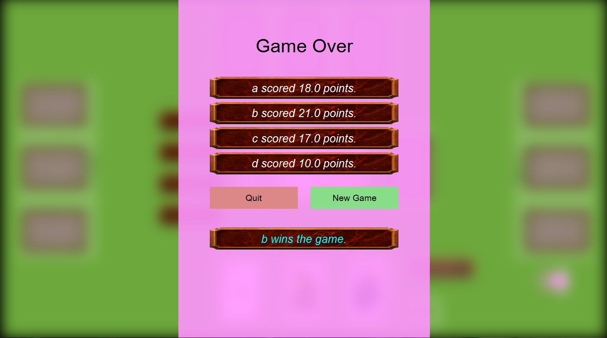

# SoPra Projekt 1

* Schwimmen Kartenspiel

# Bilder vom Spiel

## Startbildschirm

## bis zu 4 Spieler

## GameStart

## Change All Action

## Letzte Runde

## GameFinished

## Wichtige Links

* Schwimmen Kartenspiel https://de.wikipedia.org/wiki/Schwimmen_(Kartenspiel)
* Aktuelle Informationen zu diesem SoPra: https://sopra.cs.tu-dortmund.de/wiki/sopra/22b/start
* Beispielprojekt Kartenspiel War: https://sopra-gitlab.cs.tu-dortmund.de/internal/bgw-war
* Weitere Links: https://sopra.cs.tu-dortmund.de/wiki/infos/links/
